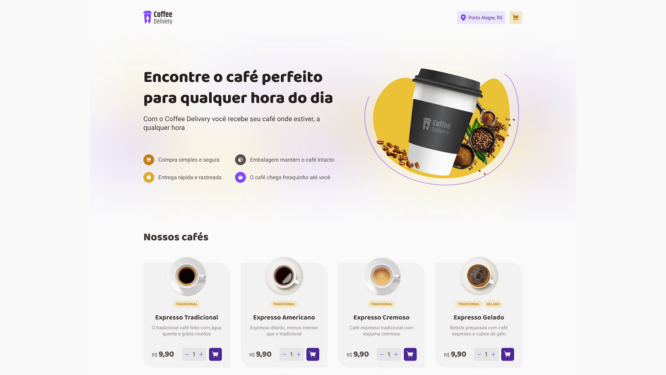
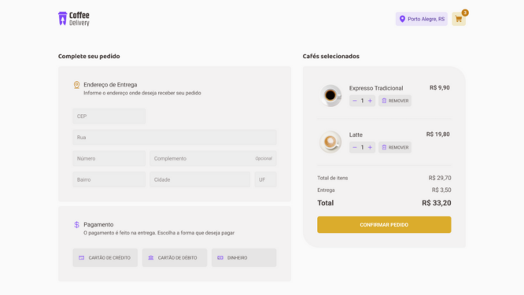
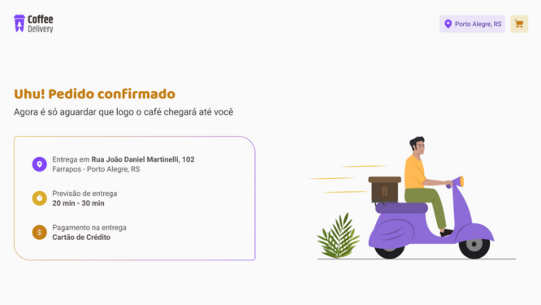

<h1 align="center">
  
</h1>

<br>

<h4 align="center">

    🚧 Coffee Delivery ☕
    🚧 Em Desenvolvimento 🔨
</h4>

<br>

## 💻 Sobre o projeto
O Coffee-Delivery foi um site criado como desafio do módulo ignite na @rocketseat. O objetivo era criar uma loja que vendesse alguns tipos de cafés de uma loja fictícia. Entre os principais conhecimentos obtidos nesse desafio foi o de trafegar dados entre as páginas como é visto no carrinho da loja. 

---
<br>

## ⚙️ Funcionalidades
- [ ] adicionar produtos ao carrinho
- [ ] ver itens no carrinho
- [ ] aumentar e diminuir a quantidade de itens no carrinho
- [ ] remover um produto na página de carrinho
- [ ] realizar a compra com dinheiro e cartão de débito/crédito
- [ ] ser redirecionado para página de obrigado ao completar o pedido na página de checkout

---
<br>

## 🎨 Layout

<div align="center">
  
  
  
</div>

---
<br>

## 🚀 Como executar o projeto

### Pré-requisitos
Para executar o projeto você irá precisar ter instalado algumas ferramentas em sua máquina:
[Git](https://git-scm.com/), [Node.js](https://nodejs.org/)

### 🏁 Rodando a aplicação Web
```bash
# Clone este repositório
$ git clone https://github.com/thegabrielrodrigues/coffee-delivery.git

# Acesse a pasta do projeto
$ cd coffee-delivery

# Instale o yarn caso não esteja instalado
$ npm install -g yarn

# Instale as dependências
$ yarn install

# Execute a aplicação
$ yarn run dev
```

## 📚 Conceitos e tecnologias utilizadas no projeto
- Typescript
- Context API
- Reducer
- RadixUI
- Zod
- styled-components
- react-router-dom
